# Concord — Collaborative Document Editor

A real-time, Google-Docs-style plain-text collaborative editor built around **Operational Transformation (OT)**, as a learning project to understand OT, distributed-systems invariants, and service decomposition deeply. Five independently deployable services, no snapshotting (the op log is append-only forever, by design), and every cross-service call is a real network call (gRPC, REST, WebSocket, or JDBC) — nothing is an in-process shortcut.

> The full documentation (architecture, OT/CRDT deep-dives, sequence diagrams, scaling story, bug postmortems, interview Q&A) is inlined directly below, and is also rendered live in the app itself at `/docs.html` once running (same content, served from [`frontend-server/src/main/resources/static/docs/architecture.md`](frontend-server/src/main/resources/static/docs/architecture.md) — duplicated here on purpose so it reads in full directly on GitHub, not just at runtime).

---

## Table of Contents

- [Quick Start (Docker Compose)](#quick-start-docker-compose)
- [Running Without Docker](#running-without-docker)
- [Project Structure](#project-structure)
- [Ports Reference](#ports-reference)
- [Environment Variables](#environment-variables)
- [Testing](#testing)
- [Full Documentation](#full-documentation)
  - [Part 1 — Executive Summary](#part-1)
  - [Part 2 — Architecture Diagrams](#part-2)
  - [Part 3 — Component-by-Component Breakdown](#part-3)
  - [Part 4 — Operational Transformation Deep Dive](#part-4)
  - [Part 5 — CRDTs Deep Dive](#part-5)
  - [Part 6 — Java Concurrency Model](#part-6)
  - [Part 7 — Protocols](#part-7)
  - [Part 8 — Durability (Phase 5)](#part-8)
  - [Part 9 — The gRPC Split (Phase 6)](#part-9)
  - [Part 10 — Document Deletion](#part-10)
  - [Part 11 — Deployment](#part-11)
  - [Part 13 — Scaling to Millions of Users/Documents](#part-13)
  - [Part 14 — Known Limitations](#part-14)

---

## Quick Start (Docker Compose)

The whole stack — Postgres, `document-service`, `connection-tier`, `document-metadata-service`, `frontend-server` — builds and runs as five containers on a shared Docker network.

```bash
git clone https://github.com/AK9175/concord.git
cd concord
docker compose up -d --build
```

Then open **http://localhost:8082**. Everything (durable storage, all five services) is up at that point — no extra setup.

```bash
docker compose ps                              # confirm all 5 are healthy/running
docker compose logs -f connection-tier          # tail any one service's logs
docker compose down                             # stop everything (data volume persists)
docker compose down -v                          # stop AND wipe the Postgres volume
```

## Running Without Docker

Useful for active development on one service at a time.

**1. Start Postgres only:**

```bash
docker compose up -d postgres
```

**2. Build everything and package each service as a self-contained fat jar:**

```bash
mvn clean package
```

**3. Run each service** (each blocks its terminal — use separate tabs, or background with `&`):

```bash
java -jar document-service/target/document-service-0.1.0-SNAPSHOT.jar
java -jar connection-tier/target/connection-tier-0.1.0-SNAPSHOT.jar
java -jar document-metadata-service/target/document-metadata-service-0.1.0-SNAPSHOT.jar
java -Dfrontend.dir=frontend-server/src/main/resources/static \
     -jar frontend-server/target/frontend-server-0.1.0-SNAPSHOT.jar
```

All four default to `localhost` for inter-service addresses (matching Postgres on `5432`, `document-service` on `9090`, `connection-tier`'s admin port on `8091`), so no environment variables are required for an all-local run. See [Environment Variables](#environment-variables) to point any service at a different host (e.g. running services on separate machines).

## Project Structure

| Module | Type | Purpose |
|---|---|---|
| `ot-core` | Library | `Operation`/`transform()`/`apply()` — the OT engine itself, zero dependencies |
| `document-service-proto` | Library | `.proto` schema + generated gRPC stubs shared between `document-service` and its callers |
| `connection-tier-proto` | Library | `.proto` schema + generated gRPC stubs for connection-tier's admin (eviction) RPC |
| `document-service` | Service | OT sequencing + durable Postgres-backed op log; gRPC server |
| `connection-tier` | Service | WebSocket termination, presence/cursors; gRPC client to `document-service`; small admin gRPC server |
| `document-metadata-service` | Service | Document catalog + per-document roster; REST; orchestrates document deletion |
| `frontend-server` | Service | Static HTML/CSS/JS, zero build step (Tailwind + marked + mermaid all via CDN) |

Every service module has its own `Dockerfile`; `docker-compose.yml` at the repo root wires all of them together.

## Ports Reference

| Port | Service | Protocol |
|---|---|---|
| 8082 | `frontend-server` | HTTP (static files) |
| 8083 | `document-metadata-service` | HTTP (REST) |
| 8081 | `connection-tier` | WebSocket |
| 8091 | `connection-tier` | gRPC (admin/eviction only) |
| 9090 | `document-service` | gRPC |
| 5432 | Postgres | JDBC |

## Environment Variables

| Variable | Read by | Default |
|---|---|---|
| `CONCORD_DB_URL` | `document-service`, `document-metadata-service` | `jdbc:postgresql://localhost:5432/concord` |
| `CONCORD_DB_USER` | `document-service`, `document-metadata-service` | `concord` |
| `CONCORD_DB_PASSWORD` | `document-service`, `document-metadata-service` | `concord` |
| `DOCUMENT_SERVICE_HOST` | `connection-tier`, `document-metadata-service` | `localhost` |
| `DOCUMENT_SERVICE_PORT` | `connection-tier`, `document-metadata-service` | `9090` |
| `CONNECTION_TIER_ADMIN_HOST` | `document-metadata-service` | `localhost` |
| `CONNECTION_TIER_ADMIN_PORT` | `document-metadata-service` | `8091` |

`docker-compose.yml` sets all of these to the right Docker-internal-DNS hostnames already — you only need to touch them for a non-Docker, multi-machine deployment.

## Testing

```bash
docker compose up -d postgres   # most test suites need a real Postgres reachable at localhost:5432
mvn clean test
```

786+ tests across all modules, including: the OT convergence property test (300+ randomized scenarios), real two-process gRPC integration tests, a deliberate process-restart durability test, and a live container-to-container verification of document deletion (eviction + content/metadata/roster wipe).

## Full Documentation


<a id="part-1"></a>
# Part 1: Executive Summary

Concord is a real-time, Google-Docs-style plain-text collaborative editor, built as a learning project to understand **Operational Transformation (OT)**, distributed systems invariants, and service decomposition deeply — not to ship a commercial product. Every design decision in this document is made in service of that goal: where a "real" product might snapshot its history to save space, this project deliberately keeps the **entire op log forever, unbounded, append-only** — because the whole point is being able to inspect, replay, and reason about every edit that ever happened.

The system started as a single Java library (`ot-core`) and grew, phase by phase, into five independently deployable services:

| Service | Owns | Port(s) |
|---|---|---|
| `frontend-server` | Static HTML/CSS/JS | 8082 |
| `document-metadata-service` | Document catalog + per-document roster | 8083 |
| `connection-tier` | WebSocket sessions, presence, cursors | 8081 (WS), 8091 (admin gRPC) |
| `document-service` | OT sequencing + durable op log | 9090 (gRPC) |
| Postgres | All durable state | 5432 |

Each phase of the build is preserved in this document's history sections, including the **real bugs** found along the way — because the bugs, and how they were found, taught more about OT and concurrency than the happy path ever did.

---

<a id="part-2"></a>
# Part 2: Architecture Diagrams

## 2.1 Current Topology (as built)

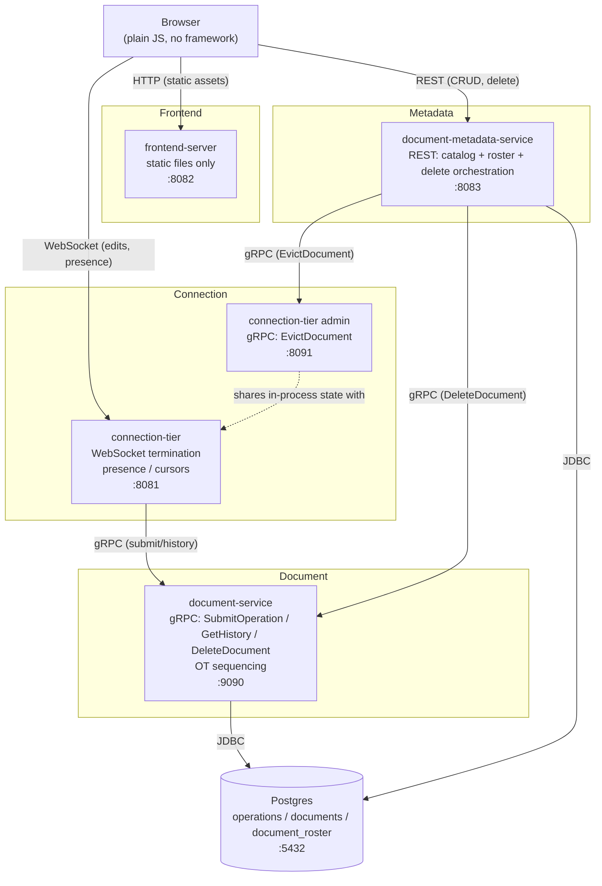

**Why this shape, not a monolith:** each box above was deliberately made its own Maven module and its own deployable process specifically to practice the boundary discipline real distributed systems need — every cross-box arrow above is either an actual network call (gRPC, REST, WebSocket, JDBC) by the time the project reached Phase 6, not an in-process shortcut. Phases 1-5 took shortcuts (described in Part 10) that were later removed on purpose, so the "before" and "after" of removing a shortcut could be directly observed and tested.

## 2.2 Layered / Clean-Architecture View

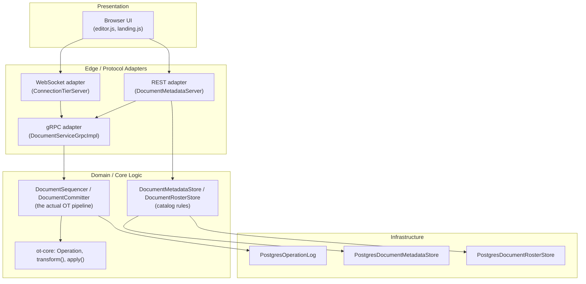

The domain layer (`ot-core`'s `transform()`/`apply()`, and `DocumentSequencer`/`DocumentCommitter`'s sequencing rules) has **zero knowledge** of gRPC, WebSockets, REST, or Postgres — every one of those is a swappable adapter around it. This is what let `OperationLog` go from in-memory (Phase 2) to Postgres-backed (Phase 5) with no change to a single line of `DocumentCommitter`, and what let `document-service` go from an in-process call (Phase 2-5) to a real gRPC server (Phase 6) with no change to `DocumentSequencer` either.

## 2.3 Target Topology — Scaled for Millions of Users (see Part 13)

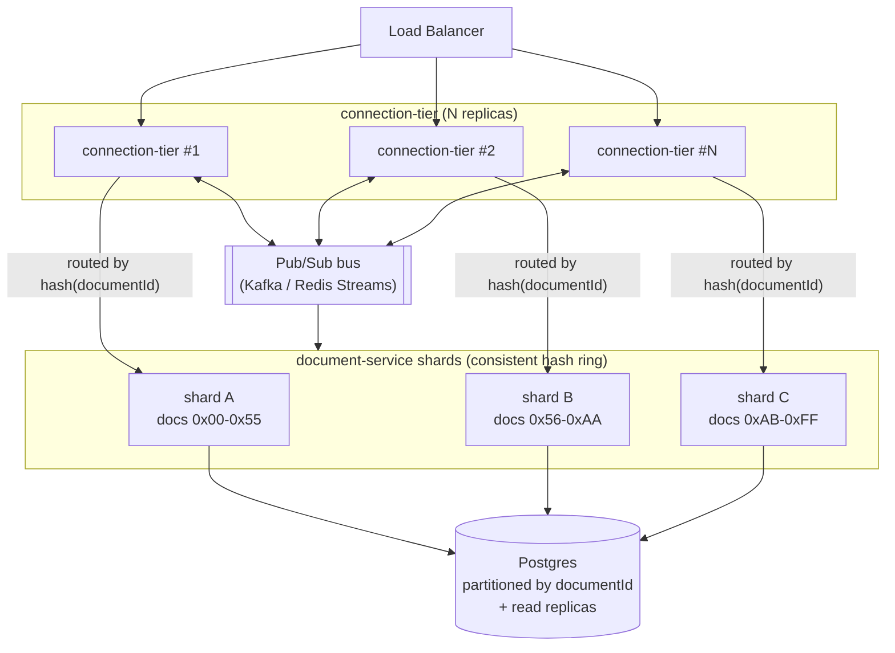

This is **not built** — it's the deliberate next step if/when this project needed to scale, and Part 13 explains exactly why each new box is needed and what breaks without it.

---

<a id="part-3"></a>
# Part 3: Component-by-Component Breakdown

For each component: what it owns, why it's a separate deployable, and the specific tradeoffs of the technology chosen.

## 3.1 `ot-core`

**What it owns:** `Operation` (sealed interface: `InsertOperation`, `DeleteOperation`), `CommittedOperation`, `OperationTransformer.transform()`, `OperationApplier.apply()`/`applyAll()`.

**Why a separate module:** it's a pure library — no `main()`, no network code, no I/O at all. Every other module depends on it. Keeping it dependency-free (no Jackson, no gRPC) means the actual conflict-resolution math can be tested in complete isolation, which is exactly what the 640-test `ConvergencePropertyTest` does.

**Tradeoff — sealed interface + pattern matching vs a generic "Operation" class with a type enum field:** Java's sealed interfaces make the compiler enforce that every pairwise `transform()` case is handled (a `switch` over a sealed type without a default branch won't compile until all cases are covered). The cost is that adding a third operation type (e.g., a future "replace") would require touching every `transform()` pair, not just adding a new branch — an explicit, deliberate tradeoff in favor of compile-time exhaustiveness over easy extension, justified because this project never adds a third operation type -- a "replace" operation was considered and explicitly rejected during Phase 3 for exactly this reason.

## 3.2 `document-service`

**What it owns:** `DocumentSequencer` (per-document single-threaded executors), `DocumentCommitter` (the actual gap-transform/apply/append pipeline), `OperationLog` (interface) with `InMemoryOperationLog` and `PostgresOperationLog` implementations, and the gRPC server exposing all of it.

**Why a separate module/process:** this is the one component that must never process two operations for the *same* document concurrently — colocating it with anything else would make that invariant harder to reason about. Splitting it out in Phase 6 also makes it the natural unit to *shard* later (Part 13) — `connection-tier` doesn't care which `document-service` instance it's calling, just that it can reach **a** correct one for a given `documentId`.

**Tradeoff — durable Postgres writes synchronously, no batching:** Phase 5 explicitly considered batching writes (flush every 30-60s) to cut latency, and rejected it. Batching forces a choice between acking before the flush (fast, but acked edits can be silently lost on a crash) or acking after (correct, but up to a minute of ack latency). Synchronous per-op writes are single-digit milliseconds — already imperceptible at human typing speed — so the latency cost bought nothing worth trading correctness for.

## 3.3 `document-service-proto` / `connection-tier-proto`

**What they own:** just `.proto` schemas and their generated Java/gRPC stub classes — zero business logic.

**Why separate modules instead of putting the `.proto` file inside the service that implements it:** if `connection-tier` depended on `document-service` directly for the generated stub classes, it would transitively pull in *all* of `document-service`'s actual implementation code too (`DocumentSequencer`, `PostgresOperationLog`, etc.) — exactly the in-process coupling Phase 6 exists to remove. A tiny shared "contract-only" module, depended on by both the client and the server side, is the standard idiomatic gRPC project layout for exactly this reason.

## 3.4 `connection-tier`

**What it owns:** WebSocket session lifecycle (`DocumentSessionRegistry`), presence (`PresenceRegistry`), the `DocumentServiceClient` gRPC stub, `DocumentTaskSequencer` (connection-tier's own per-document atomicity, see Part 7), and the small admin gRPC server used only for document deletion.

**Why `org.java-websocket` instead of, say, Spring WebFlux or Jetty:** the WebSocket protocol needed here is small (5-6 message types) and the project's standing rule is "near-zero dependencies" — a full reactive framework would bring a large transitive dependency tree and a programming model (reactive streams) that has nothing to do with what's actually being learned here (OT and consensus-adjacent concurrency, not reactive programming).

**Tradeoff — one WebSocket port (8081) and a separate admin gRPC port (8091), not one port doing both:** WebSocket and gRPC are different wire protocols; multiplexing both on one port would need protocol sniffing on every connection. Two listeners in one process is simpler and is exactly the pattern `document-service` itself doesn't need (it only ever serves gRPC) — so `connection-tier` is the only service with two front doors, and only because it has two genuinely different kinds of callers (browsers over WebSocket, `document-metadata-service` over gRPC).

## 3.5 `document-metadata-service`

**What it owns:** the document catalog (`DocumentMetadataStore`), per-document roster (`DocumentRosterStore`), and — since the delete feature — orchestration of cross-service deletes via two gRPC clients.

**Why JDK's built-in `HttpServer` instead of Spring Boot:** six REST endpoints don't justify a web framework's dependency weight or auto-configuration magic; hand-rolled routing over `com.sun.net.httpserver.HttpServer` keeps every request's path fully traceable by reading one file (`DocumentMetadataServer.java`), which matters more for a learning project than framework conveniences would.

**Tradeoff — CORS headers on every response:** `frontend-server` runs on a different origin (different port) than this service, so without explicit `Access-Control-Allow-Origin` headers, the browser would block every response from ever reaching the page's JS even though the server handled the request correctly. The alternative (serving everything from one origin/process) was rejected specifically to keep `frontend-server` independently deployable.

## 3.6 `frontend-server`

**What it owns:** static HTML/CSS/JS, served by the JDK's `HttpServer`, with SPA-style fallback routing (`/<docId>` → `editor.html`, whose own JS reads the id from `window.location`).

**Why no build step (no Vite/webpack/React):** Tailwind is loaded via CDN `<script>` tag, exactly like jQuery would have been a decade ago — zero `node_modules`, zero bundler config, and the entire frontend is readable as plain files. The cost is no JSX, no component reactivity framework, no TypeScript — all deliberately accepted, since the actual subject of this project is server-side OT and distributed systems, not frontend tooling.

## 3.7 Postgres

**Why Postgres over a NoSQL store:** `operations(document_id, revision, ...)` with a `PRIMARY KEY (document_id, revision)` constraint is a relational, strongly-consistent table by nature — revision assignment must never produce a duplicate or a gap for a given document, exactly what a relational PK constraint enforces as a defensive backstop (the *primary* correctness mechanism is still the single-writer-per-document executor, not the database). A NoSQL store would need to reinvent this guarantee at the application layer.

**Why one shared Postgres instance for both the op log and the metadata/roster tables, not two databases:** simplicity for a single-instance deployment; Part 13 explains why this would split (op log vs metadata) under real horizontal scale.

---

<a id="part-4"></a>
# Part 4: Operational Transformation — Deep Dive

## 4.1 The Model

Every edit is one of two operations, both anchored to a **position** and the **revision** they were created against:

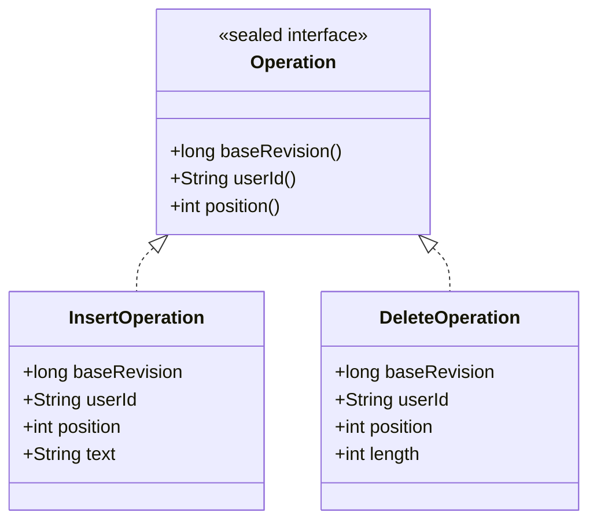

`baseRevision` is what the operation was created against on the client; the server may have committed other operations since then. That gap is exactly what `transform()` exists to close.

## 4.2 `transform()` — Reconciling Two Concurrent Edits

Given two operations created against the *same* base revision (so neither knew about the other), `transform(toTransform, appliedFirst)` adjusts `toTransform` so it can be applied *after* `appliedFirst` and still produce the intended result.

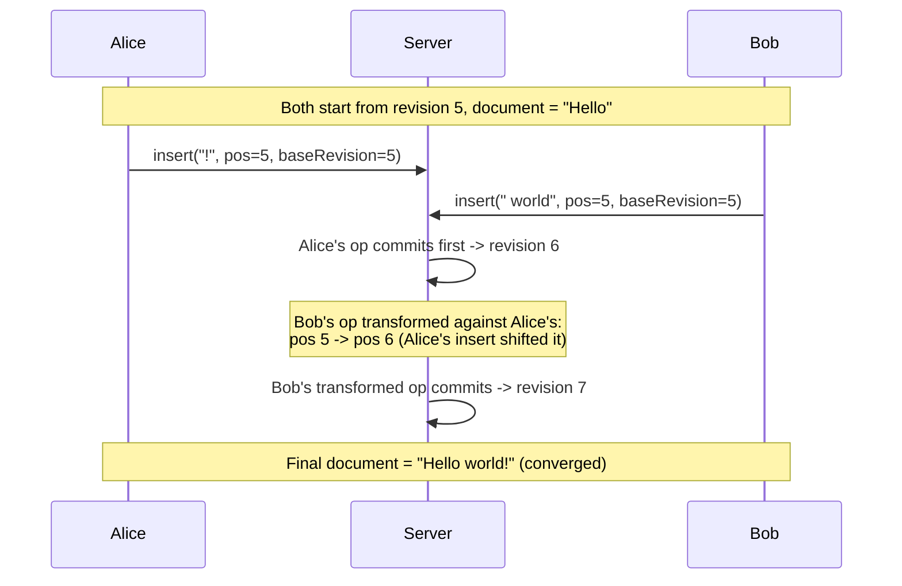

There are four pairwise cases, each with its own transform rule:

| `toTransform` \ `appliedFirst` | Insert | Delete |
|---|---|---|
| **Insert** | shift position if `appliedFirst`'s insert lands at/before it; tie-break by `userId` if at the exact same position | shift position back if the delete removed text before it |
| **Delete** | shift position forward (and possibly split into two deletes — see 4.3) if an insert landed *inside* the range being deleted | shrink/shift the range if the two deletes overlap |

## 4.3 The Insert-Survives-Delete Split

The one case that doesn't fit a single output operation: a delete whose range contains a position where a *concurrent* insert landed.

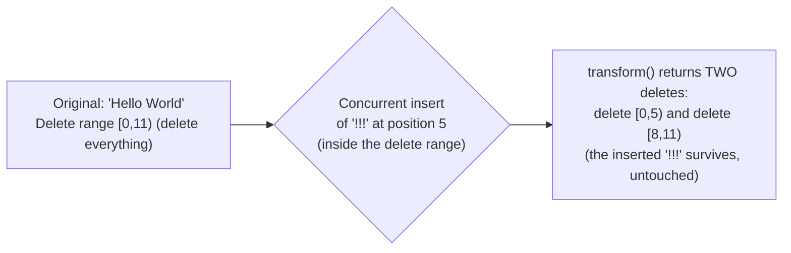

This is why `OperationTransformer.transform()` returns `List<Operation>`, not a single `Operation` — the conflict policy this project chose is that a concurrent insert **survives** inside a range another operation is deleting, rather than being silently swallowed. The two resulting delete pieces must then be applied in **descending position order** (the higher one first), since both pieces share one coordinate frame and applying the lower one first would invalidate the higher one's position.

## 4.4 TP1 vs TP2 — The Theoretical Limit

**TP1 (the property this project proves):** for any two concurrent operations, transforming A against B then applying, versus transforming B against A then applying, **converge to the same result**, regardless of which one the server happened to commit first. `ConvergencePropertyTest` proves this exhaustively across 300+ randomized 2-10 operation scenarios.

**TP2 (the property this project deliberately does NOT pursue):** that arbitrary N-way arrival order (for 3+ concurrent operations) always converges, *without* a central sequencer choosing one canonical order. A genuine counterexample was found during Phase 1 development:

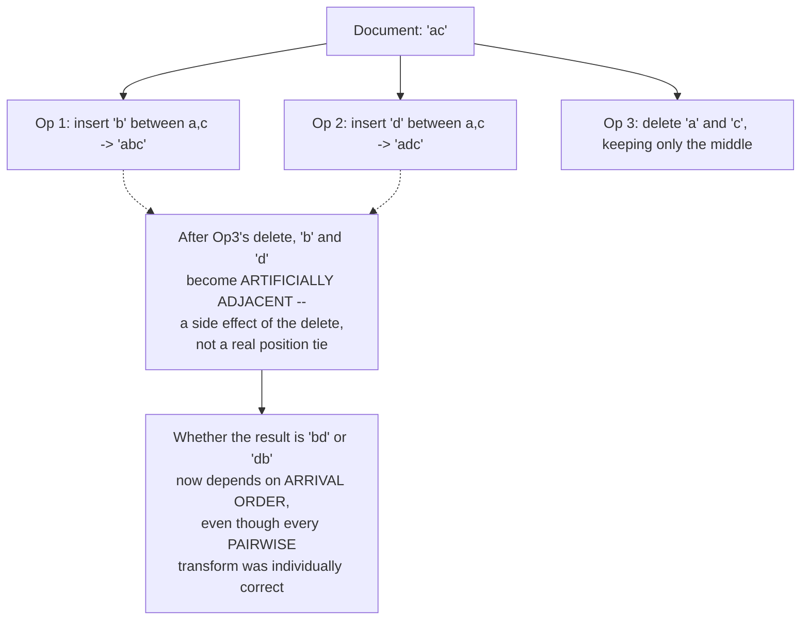

This is a known, decades-old hard problem for position-based OT (achieving real TP2 needs CRDT-style stable identifiers instead — see Part 5). **Production OT systems, including Google Docs, don't solve TP2 either** — they sidestep it the same way this project does: a single authoritative sequencer per document (`DocumentSequencer`'s per-document executor) ensures only **one** arrival order ever actually happens. Clients reconcile to that one canonical order; N-way independence is never needed because N-way arrival never occurs.

## 4.5 `apply()` — Materializing Text

`OperationApplier.apply(document, operation)` does the literal string surgery (`StringBuilder.insert`/`delete`). `applyAll(document, operations)` applies a list in **descending position order** — required specifically for the multi-piece result from 4.3, where the pieces share a coordinate frame rather than forming a sequential chain.

---

<a id="part-5"></a>
# Part 5: CRDTs — Deep Dive

## 5.1 Why CRDTs Exist

CRDTs (Conflict-free Replicated Data Types) solve the *same* problem OT does — converging concurrent edits — but with a structurally different guarantee: **any two replicas that have seen the same set of operations, in *any* order, converge to the same state.** That's TP2, solved by construction, with no central sequencer required.

## 5.2 How: Stable Identifiers, Not Positions

The core idea (e.g., RGA — Replicated Growable Array, or Logoot): instead of "insert at position 5," every character gets a **globally unique, totally-ordered identifier** assigned once, at creation, that never changes.

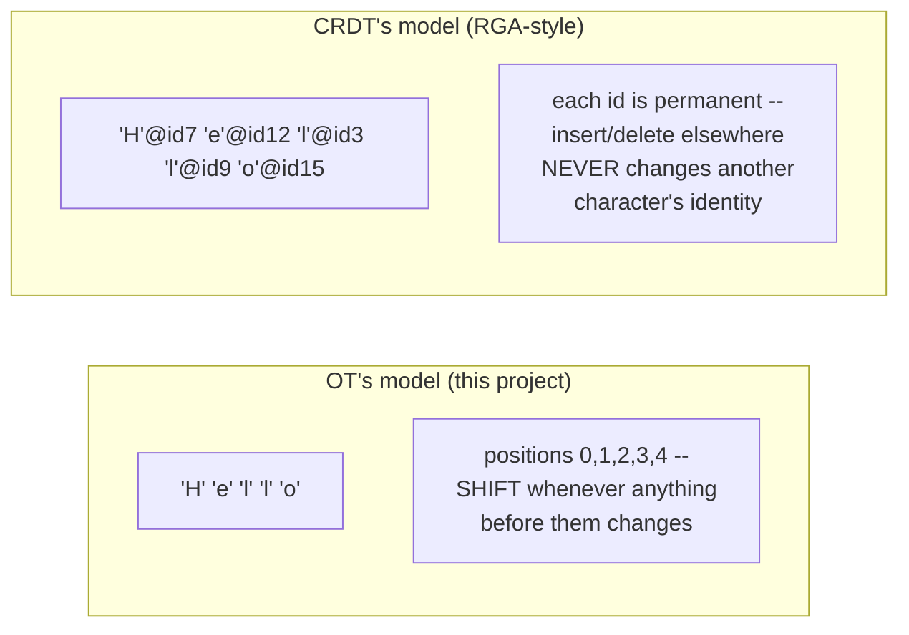

Because identities never shift, "insert X after the character with id=12" means the same thing **no matter what order** other concurrent operations arrive in or what they did — there's no equivalent of OT's "transform against the gap" step at all. Deletes are typically handled with **tombstones** (the character stays in the data structure, marked deleted, rather than physically removed) specifically so a concurrent operation that referenced "after id=12" still has something to anchor to even if id=12's character was deleted by someone else.

## 5.3 State-Based vs Operation-Based CRDTs

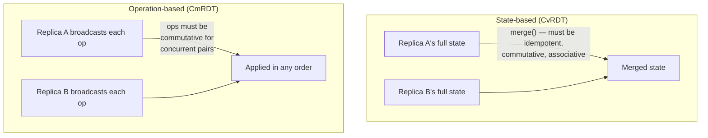

State-based CRDTs exchange whole snapshots and merge them (simpler to reason about, more bandwidth); operation-based CRDTs exchange individual operations (less bandwidth, needs reliable delivery). Either way, the defining requirement is that the merge/apply function is **commutative for concurrent operations** — which is exactly what stable identifiers buy for free, and what OT has to work much harder for via `transform()`.

## 5.4 Why This Project Chose OT, Not a CRDT

| | OT (this project) | CRDT |
|---|---|---|
| Convergence guarantee | TP1 only, relies on a sequencer for the rest | TP2, by construction, no sequencer needed |
| Identifier overhead | None — plain character positions | Per-character unique IDs (real memory/bandwidth cost) |
| Deletes | Physically removed | Usually tombstoned (grows the document's metadata forever unless compacted) |
| Server role | Required (the sequencer) | Optional (peer-to-peer convergence is possible) |
| Learning value here | Forces understanding of `transform()` math and *why* a sequencer is needed | Would have taught a different lesson (stable identifiers, tombstones) |

The deciding factor was architectural, not performance: this project's explicit invariant #1 is "a single authoritative sequencer per document" — once that's a given (and it is, since this is a client-server product, not peer-to-peer), TP1 + a sequencer is *sufficient*, and OT is simpler to implement and reason about than introducing per-character identifiers and tombstone garbage collection for a guarantee (TP2) the architecture doesn't actually need.

---

<a id="part-6"></a>
# Part 6: Java Concurrency Model

## 6.1 `CompletableFuture` as the Async Backbone

Every cross-boundary call in this codebase — gRPC calls, the original in-process calls before Phase 6 — returns `CompletableFuture<T>`, never blocks the caller, and chains `.thenAccept()`/`.exceptionally()` rather than using callbacks or blocking `.get()`. The one hard-learned rule (from a real production-shaped bug found during Phase 4): **an exception thrown inside a `.thenAccept()` with no `.exceptionally()` attached vanishes completely silently** — no log, no crash, nothing. Every async chain in this codebase now ends in `.exceptionally(this::logAsyncFailure)` specifically because of that bug.

## 6.2 Per-Document Single-Threaded Executors — A Lock Substitute

Instead of a `synchronized` block or an explicit `Lock` guarding each document's state, `DocumentSequencer` gives every document its **own** single-threaded `ExecutorService`, created lazily on first touch:

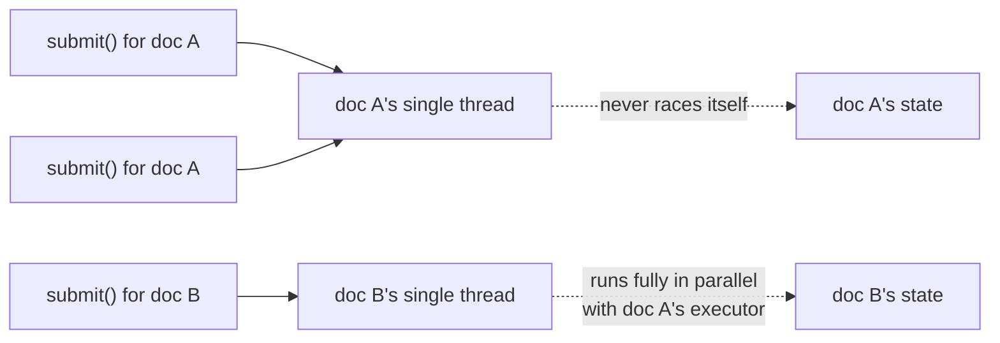

This guarantees two operations for the *same* document are never mid-commit at once, with **zero explicit locking code** — the guarantee comes entirely from "only one thread is ever allowed to touch this document's state." Different documents proceed in full parallel, since they're different executors. The accepted cost: one parked OS thread per document ever touched, for the life of the process — never garbage collected, even after a document is deleted (a deliberate, documented simplification, not an oversight).

## 6.3 The Atomicity-Relocation Problem (Phase 6)

Before Phase 6, `DocumentSequencer.connect()` atomically combined "register this WebSocket as a broadcast peer" and "read full history" on the document's own executor thread — preventing a race where a commit landing in the gap between those two steps could be delivered to a new client twice, or not at all.

Once `document-service` became a separate process, it had **no idea `connection-tier`'s peer list even existed** — so that atomicity had to be rebuilt, on `connection-tier`'s side, as `DocumentTaskSequencer`: connection-tier's *own* per-document single-threaded executor, serializing "connect" against "submit+broadcast" the same way `DocumentSequencer` always serialized commits.

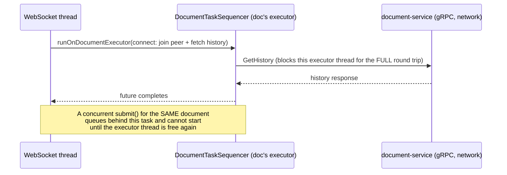

The subtle implementation detail: each queued task calls `.get()` on the gRPC call's future — not just kicks off the async call — so the executor thread is genuinely occupied for the *entire* network round trip, not just until the request is sent. Skipping that would let a second task for the same document start before the first one's broadcast-dependent side effect actually landed, reopening the exact race this exists to close.

---

<a id="part-7"></a>
# Part 7: Protocols

## 7.1 WebSocket Messages (`connection-tier`, port 8081)

**Client → Server:**

| Type | Payload | Purpose |
|---|---|---|
| `insert` / `delete` | raw `Operation` JSON | submit an edit |
| `resync` | — | re-fetch full history (client-side correctness safety net) |
| `presence` | `userId, username, color` | announce identity on this document |
| `updateCursor` | `position` | broadcast caret position |

**Server → Client:**

| Type | Payload | Purpose |
|---|---|---|
| `history` | `committed: CommittedOperation[]` | full op log, sent once on connect/resync |
| `ack` | `committed` | sent only to the op's originator |
| `update` | `committed` | sent to every other connection on the document |
| `presence-snapshot` / `presence-join` / `presence-leave` | roster info | presence lifecycle |
| `cursor-update` | `userId, position` | a peer's caret moved |
| `deleted` | `documentId` | this document was deleted; the connection is about to close |

## 7.2 REST (`document-metadata-service`, port 8083)

| Method | Path | Purpose |
|---|---|---|
| `POST` / `GET` | `/docs` | create / list documents |
| `GET` / `PATCH` / `DELETE` | `/docs/{id}` | fetch / rename / delete a document |
| `GET` / `POST` | `/docs/{id}/users` | list / add roster entries |
| `PATCH` | `/docs/{id}/users/{userId}` | rename a roster entry |

## 7.3 gRPC

**`document-service-proto`** (`document-service`, port 9090): `SubmitOperation`, `GetHistory`, `DeleteDocument`.

**`connection-tier-proto`** (`connection-tier` admin, port 8091): `EvictDocument` — the only RPC `document-metadata-service` calls on `connection-tier`.

---

<a id="part-8"></a>
# Part 8: Durability (Phase 5)

## 8.1 Schema

```sql
CREATE TABLE operations (
    document_id TEXT NOT NULL,
    revision BIGINT NOT NULL,
    user_id TEXT NOT NULL,
    op_type TEXT NOT NULL,
    base_revision BIGINT NOT NULL,
    op_data JSONB NOT NULL,
    created_at TIMESTAMPTZ NOT NULL DEFAULT now(),
    PRIMARY KEY (document_id, revision)
);
```

No snapshot table exists anywhere in this schema, by design — `documents`/`document_roster` hold only metadata, never content. The *only* representation of a document's text is the full replay of its `operations` rows.

## 8.2 Ack-After-Durable-Write

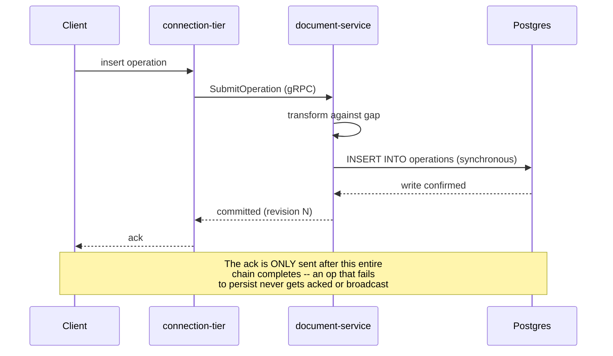

This required no new code beyond wiring in `PostgresOperationLog` — `DocumentCommitter.commit()` already called `operationLog.append()` synchronously before returning, and the ack only fires after that whole `CompletableFuture` chain completes. The guarantee was structural from Phase 2 onward; Phase 5 just made the write itself durable.

## 8.3 Cold-Start Rebuild

`document-service` keeps an in-memory cache of each document's *current text* (`DocumentCommitter.textByDocument`) purely as a performance shortcut — replaying potentially thousands of op-log rows on every keystroke would be wasteful. On a cold document (cache miss, e.g. right after a restart), `currentText()` lazily rebuilds that one entry by replaying the *real* durable log from revision 1. This is also what makes a `document-service`-only restart safe while `connection-tier` keeps running (verified directly in Part 9.2).

---

<a id="part-9"></a>
# Part 9: The gRPC Split (Phase 6)

## 9.1 Why gRPC, Not REST or a Message Bus

| | REST/JSON | Message bus (Kafka/Redis) | gRPC (chosen) |
|---|---|---|---|
| Speed | HTTP/1.1, text serialization | Fast, but decouples request/response | HTTP/2 multiplexing + binary protobuf |
| Fit for this pipeline | Fine, but a new dependency style alongside everything else | Overkill — this is a synchronous request/response pipeline, not pub/sub | Matches the synchronous submit-and-wait-for-ack shape exactly |
| Schema | None enforced | None enforced | `.proto` enforces a strict contract both sides compile against |

The real bottleneck in this pipeline is the **synchronous Postgres write** (Part 8.2), not the wire protocol — so gRPC's speed advantage over REST is real but secondary. The schema enforcement and the natural fit for a request/response shape were the deciding factors.

## 9.2 Verifying the Split Actually Works

This is the one part of the system proven **live**, not just by unit tests: `document-service` and `connection-tier` were started as two genuinely separate OS processes, a WebSocket client opened a connection and typed "Hello," then `document-service` *alone* was killed and restarted while `connection-tier` and the open WebSocket session never restarted. The next edit correctly built on the real prior content ("Hello"), not an empty string — proving both that gRPC's `ManagedChannel` transparently reconnects, and that Part 8.3's cold-start rebuild survives a restart of just the data-holding side.

---

<a id="part-10"></a>
# Part 10: Document Deletion

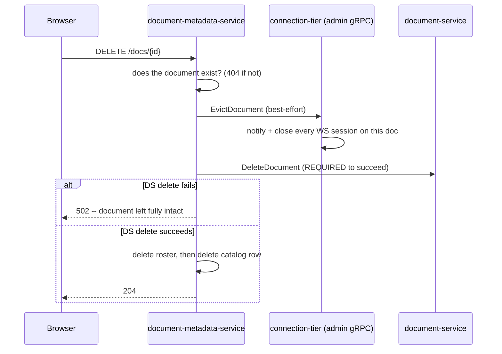

The ordering is deliberate, since this isn't a transaction across three services: eviction is best-effort first (a briefly-unreachable `connection-tier` shouldn't block a delete nobody may even be watching), wiping `document-service`'s content is **required** (a failure here leaves the document fully visible and retryable, never an orphaned catalog entry with no content behind it), and the catalog row itself is removed last, once the underlying content is confirmed gone.

---

<a id="part-11"></a>
# Part 11: Deployment

## 11.1 Docker Compose Topology

All five pieces (`postgres`, `document-service`, `connection-tier`, `document-metadata-service`, `frontend-server`) run as separate containers, networked via Docker's internal DNS (service names resolve as hostnames). Postgres has a `pg_isready` healthcheck specifically because HikariCP fails fast (no retry) on construction — without `condition: service_healthy`, the dependent services would crash-loop on a cold start before Postgres finished booting.

## 11.2 Environment Variables

| Variable | Used by | Default |
|---|---|---|
| `CONCORD_DB_URL` / `_USER` / `_PASSWORD` | `document-service`, `document-metadata-service` | `localhost:5432` |
| `DOCUMENT_SERVICE_HOST` / `_PORT` | `connection-tier`, `document-metadata-service` | `localhost:9090` |
| `CONNECTION_TIER_ADMIN_HOST` / `_PORT` | `document-metadata-service` | `localhost:8091` |

## 11.3 Local Run

```bash
docker compose up -d --build
# then open http://localhost:8082
```

---

<a id="part-13"></a>
# Part 13: Scaling to Millions of Users and Documents

Everything above describes a **single instance** of each service. Here's what would actually need to change, and why each change is necessary — not just "add more servers."

## 13.1 Sharding `document-service` by Consistent Hashing

Today, one `document-service` process holds every document's per-document executor and in-memory text cache. At scale, documents would be partitioned across **N shards** via a consistent hash ring keyed on `documentId`:

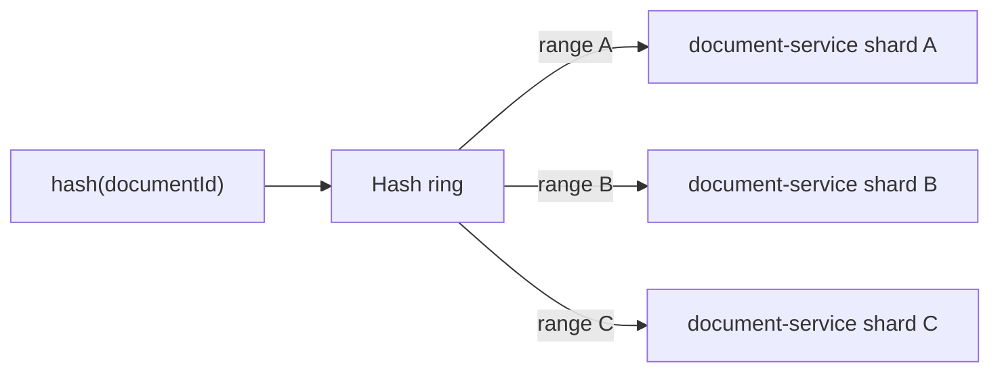

**Why consistent hashing specifically:** a plain `hash % N` re-shuffles *every* document when a shard is added or removed; consistent hashing only moves the documents that fall in the changed range, which matters enormously when N changes under live traffic. Each document is owned by exactly one shard at a time, so the in-memory text cache stays valid for the document's *entire* life on that shard — cache invalidation only matters during a rebalance, which is the one moment a shard must flush a moving document's cache and let the new owner rebuild it from Postgres (the exact mechanism Part 8.3 already has, just triggered by rebalancing instead of a restart).

## 13.2 Why `connection-tier` Can't Just Be Replicated Naively

Today, `connection-tier`'s broadcast logic assumes **every WebSocket client editing a document is connected to this same process** — `deliver()` just iterates its own local `DocumentSessionRegistry`. The moment there are multiple `connection-tier` instances behind a load balancer, that assumption breaks: Alice might be connected to instance #1, Bob to instance #2, and instance #1 has no way to tell instance #2 "broadcast this to your local peers too."

**The fix:** a pub/sub bus (Kafka or Redis Streams) that every `connection-tier` instance subscribes to, keyed by `documentId`. When any instance commits an op, it publishes the result to the bus instead of (or in addition to) broadcasting locally; every instance with a subscriber for that `documentId` delivers it to its own local WebSocket connections.

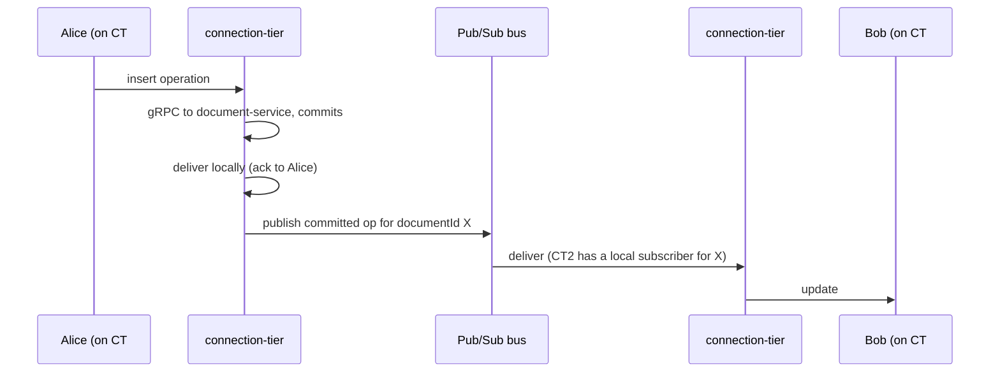

## 13.3 Postgres at Scale

A single Postgres instance becomes the next bottleneck: partition the `operations` table by `document_id` (range or hash partitioning) so any one shard's write load doesn't contend with another's, and add read replicas for `GetHistory`/resync traffic, which is read-heavy and doesn't need to hit the primary. If write throughput to the op log itself ever becomes the limit (unlikely before sharding helps significantly), the next step is replacing the *log* specifically with a purpose-built append-only store (Kafka, keyed by `documentId`) while keeping Postgres for metadata/roster, which stays comparatively small and low-traffic.

## 13.4 What Scales Almost For Free

`document-metadata-service` and `frontend-server` are both already stateless (all real state lives in Postgres or the other services) — horizontally replicating either behind a load balancer requires no new design, just more containers. This is true *today*, at the current single-instance scale, and stays true at any scale.

## 13.5 Other Concerns at Scale (not yet needed, but real)

- **Caching:** a CDN in front of `frontend-server`'s static assets; a shared cache (Redis) for `document-metadata-service`'s catalog reads if they become hot.
- **Rate limiting / backpressure:** nothing in this project currently limits how fast a client can submit operations — fine for a learning project, not fine once untrusted internet traffic is involved.
- **Observability:** structured logging and distributed tracing (a single request now crosses 3-4 process boundaries; correlating a slow edit across `connection-tier` → `document-service` → Postgres needs trace IDs propagated through every gRPC/JDBC call).
- **Multi-region:** not attempted here even conceptually — would require deciding where the single authoritative sequencer for a given document physically lives relative to its editors, a genuinely hard problem this project's single-region design sidesteps entirely.

---

<a id="part-14"></a>
# Part 14: Known Limitations (Today, Single-Instance)

- No authentication — the identity model is "the server trusts whatever name/color the client presents," appropriate for a learning project, not for production.
- No rate limiting on submitted operations.
- Remote cursor positions are not OT-transformed against concurrent edits — a brief, self-correcting visual lag after a concurrent edit is accepted, not fixed.
- No horizontal scale-out (Part 13 describes it; none of it is built).
- Single Postgres instance, no replication, no partitioning.
- The op log is genuinely unbounded — by design, but worth saying plainly: this would not be acceptable in a real product without a compaction strategy.
- Per-document executors are never garbage collected, even for deleted documents — an accepted, documented cost, not an oversight.

